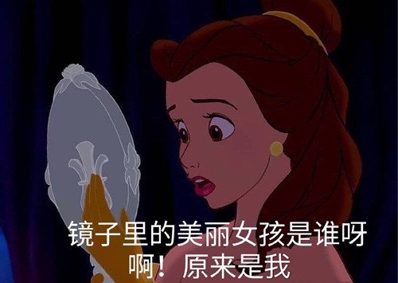
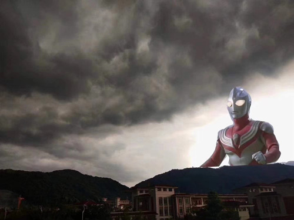

---			
title: "关于我"
layout: about	
---
一名正在**痛并快乐**的挣扎于专业学习的未来前端工程师
目前是就读于网络与新媒体专业的大一学生

- 在学课程：
信息可视化、线上调查与统计、大数据、网页制作与设计、新媒体概论、设计美学、创意思维训练等。

- 斜杠青年：
文学与传媒学院综合媒体部文稿组组长/电子竞技协会宣传部部长/校园咖啡厅水吧员工/527宿舍的吹水担当

- 擅长的事情:
摄影/文稿编辑/一点又一点的学习积累/制定计划并完成一半/当快乐肥宅

*注：上一条介绍存在一定的吹牛成分，请勿模仿*

想知道更多正经一面的荣荣，[可点击浏览其简历](https://ccrr_zn.gitee.io/resume)